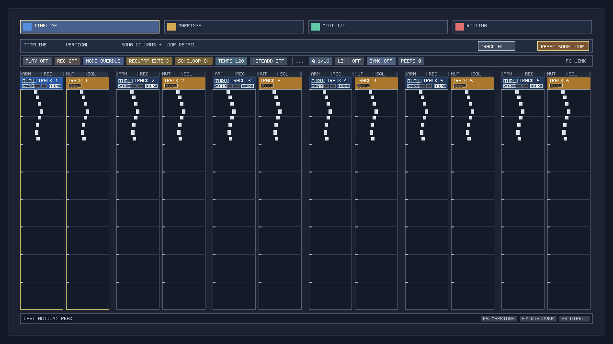
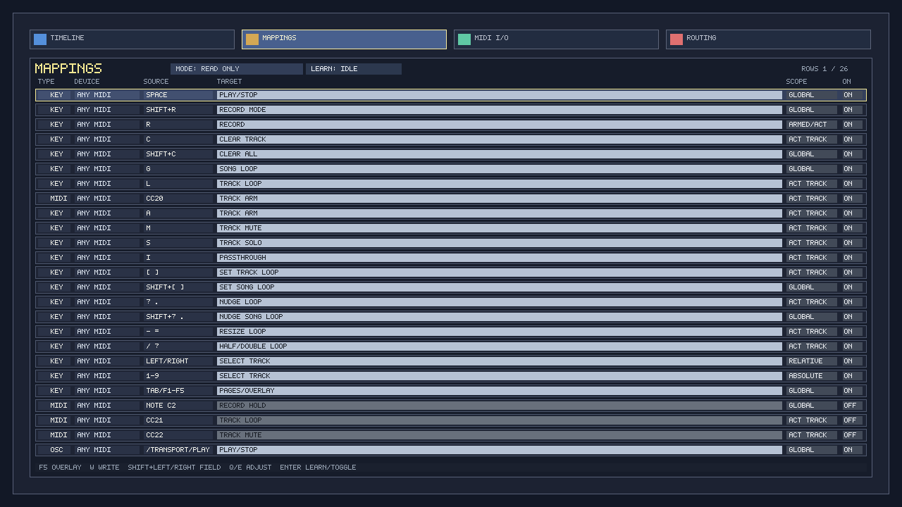
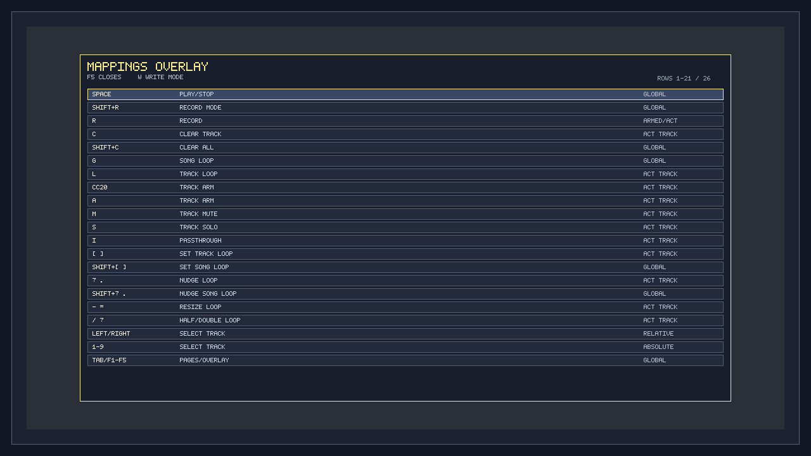
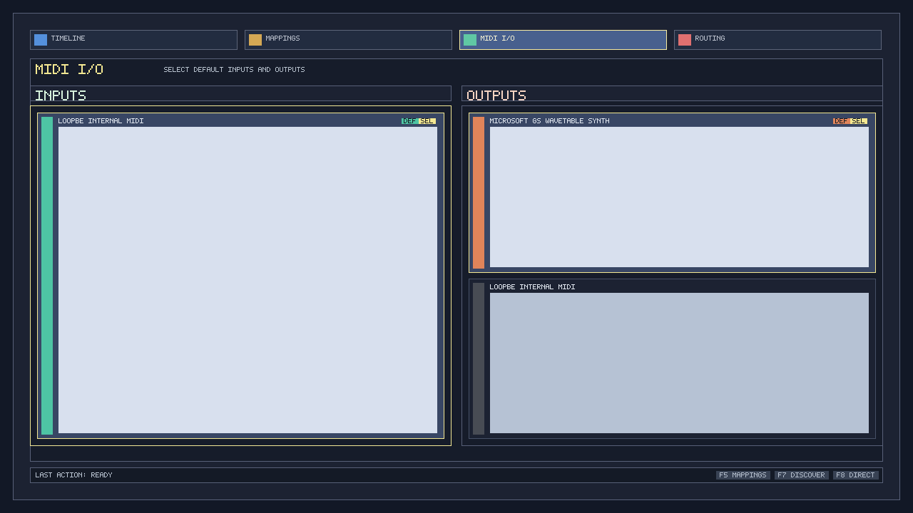
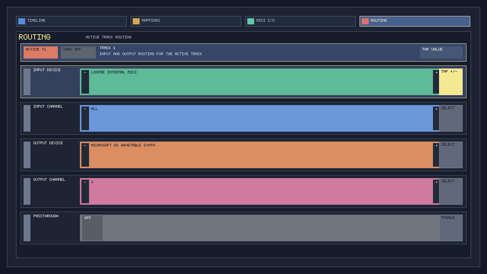

# trekr

Native MIDI-first tracker/player/looper for small PCs with a portable path to mobile-class targets.

## Screenshots

Latest renderer-owned captures from the demo state:

### Timeline



### Mappings



### Mappings Overlay



### MIDI I/O



### Routing



## Docs

- `docs/product-spec.md`: product behavior, UX model, workflows, and MVP scope.
- `docs/architecture.md`: engine architecture, portability constraints, and stack options.
- `docs/implementation-plan.md`: milestone order, module breakdown, and delivery sequence.
- `docs/current-mappings.md`: current keyboard bindings and prototype MIDI/OSC mapping overview.

## Current Direction

- Primary target: small-form-factor desktop systems.
- Secondary target: iOS/Android if the chosen stack supports it cleanly.
- V1 focus: MIDI sequencing, routing, passthrough, and loop-based recording.
- Audio follows MIDI-first V1 and should layer onto the same timeline and routing model later.
- Chosen implementation stack: Rust with a lightweight native rendering and I/O stack.
- SDL3 is built from source in the current scaffold so local builds do not depend on a preinstalled SDL runtime.

## Current Runnable Slice

`cargo run` opens a native SDL3 window with:

- fixed-fit per-track paired columns in the form `full | detail | full | detail`
- default vertical-time layout with time moving downward
- a page shell for `Timeline`, `Mappings`, `MIDI I/O`, and `Routing`
- real MIDI device enumeration via `midir`
- basic routed MIDI note playback on track output ports/channels
- MIDI output runs on a dedicated worker thread so device stalls or hot-plug churn do not block the UI thread
- in-canvas bitmap text labels for pages, tracks, ports, mappings, and routing values
- active-track highlighting
- a moving playhead
- per-track loop preview
- an in-canvas transport strip on the timeline page
- a field-based mappings editor with MIDI learn for MIDI sources
- a cross-platform Ableton Link transport layer with runtime status in the transport strip
- direct mouse/touch control for tabs, transport controls, mappings, MIDI I/O selection, and routing fields

Launch state:

- default interactive run uses persisted state from `artifacts/state/last-run.json` when available and saves back on clean exit
- `cargo run -- --state-mode demo` forces the built-in demo state
- `cargo run -- --state-mode empty` forces an empty deterministic state
- `cargo run -- --state-file path\\to\\state.json` uses a specific persisted state path
- committed fixture state lives in `state-fixtures/ui-looped.json`

Current controls:

- `Tab` / `Shift+Tab`: next/previous page
- `F1` / `F2` / `F3` / `F4`: show timeline, mappings, MIDI I/O, or routing page
- `F5`: toggle the quick mappings overlay from any page
- `F6`: toggle Ableton Link participation
- `Shift+F6`: toggle Ableton Link start/stop sync participation
- `Up` / `Down`: select current page item
- `Shift+Left` / `Shift+Right`: select current editable field on the mappings page in write mode
- `Q` / `E`: adjust current page item
- `Enter`: activate/toggle current page item
- `W`: toggle mappings page mode between read-only overview and write mode
- `N`: add a mapping row on the mappings page in write mode
- `Delete`: remove the selected mapping row on the mappings page in write mode
- `Space`: play/stop
- `R`: start/stop recording on armed tracks, or the active track if none are armed
- `Shift+R`: cycle recording mode between `Overdub` and `Replace`
- `C`: clear current track notes/regions and cancel its pending take
- `Shift+C`: clear all track notes/regions and cancel pending takes
- `Home`: reset the global song loop to the full song range
- `[` / `]`: set current-track loop start/end at playhead
- `,` / `.`: nudge current-track loop backward/forward by one quantize step
- `-` / `=`: shorten/extend current-track loop by one quantize step
- `/` / `\`: half/double current-track loop length
- `Shift+[` / `Shift+]`: set global loop start/end at playhead
- `Shift+,` / `Shift+.`: nudge global loop backward/forward by one quantize step
- `Shift+-` / `Shift+=`: shorten/extend global loop by one quantize step
- `Shift+/` / `Shift+\`: half/double global loop length
- `G`: toggle global loop enable
- `L`: toggle current track loop enable
- `A`: arm current track
- `M`: mute current track
- `S`: solo current track
- `I`: toggle current track passthrough
- `Left` / `Right`: select previous/next track directly
- `1`-`9`: select track by absolute index
- `Escape`: quit

The timeline page also exposes a clickable `Reset Song Loop` button that triggers the same action as `Home`.

Pointer/touch notes:

- tabs are clickable/tappable
- timeline transport chips are clickable/tappable for play, record, record mode, song loop, Link, and Link sync
- mappings rows and fields are clickable/tappable; in `Write` mode, tapping the selected field activates it
- MIDI I/O rows are clickable/tappable to select and set the default input/output
- routing rows are clickable/tappable; tapping the value area adjusts the field and tapping passthrough toggles it
- timeline note and region editing is still not implemented for pointer/touch input

Recording flow notes:

- armed tracks are the first recording targets; if none are armed, recording uses the active track
- stopping playback while recording commits the active take instead of discarding it
- the timeline shows committed regions behind notes and shows the in-progress take as a red preview region
- MIDI note content now comes from live input note-on/off events on each track's routed MIDI input, not a generated placeholder pattern

The `Mappings` page now supports two modes:

- `Read Only`: compact overview
- `Write`: field-based editing for source type, source device, source value, target, scope, and enabled state
- `Write` mode also supports adding/removing rows and cycling track-scoped mappings into concrete `Track 1`, `Track 2`, ... scopes

MIDI learn notes:

- in mappings `Write` mode, move to the `Source` field and press `Enter` to arm MIDI learn for the selected row
- the next incoming MIDI note or CC updates that mapping source and exits learn mode
- learned MIDI mappings store the device name of the input that triggered learn
- live MIDI input now resolves against enabled mappings and can trigger app actions from either `Any MIDI` or a specific device
- `Shift+Left` / `Shift+Right` moves between editable mapping fields

Ableton Link notes:

- Ableton Link now uses the official Ableton source from the `vendor/ableton-link` git submodule through a small native bridge, instead of the broken third-party Rust wrapper
- clone with submodules or run `git submodule update --init --recursive` so the bundled `asio` dependency is available on Linux, Windows, and macOS
- the transport strip shows Link enabled state, start/stop sync state, and peer count/status summary

The app also exposes a generic overlay layer, currently used for a quick mappings overlay that can be triggered independently of the current page.

Current planning note:

- the remaining MVP checklist now lives in `docs/implementation-plan.md`
- Ableton Link is planned as a near-term sync milestone after the core MVP workflow is comfortable, and its architecture notes live in `docs/architecture.md`

## Raspberry Pi Zero 2 W Cross-Build

The Raspberry Pi Zero 2 W is a Linux `aarch64` target, so the repo cross-build path is:

- target triple: `aarch64-unknown-linux-gnu`
- host flow: run the build inside WSL from Windows, rather than trying to drive a Linux linker from the Windows Rust toolchain

Repo entrypoint:

```powershell
powershell -ExecutionPolicy Bypass -File .\scripts\build-rpi-zero-2w.ps1 -Release
```

Expected artifact:

```text
target\aarch64-unknown-linux-gnu\release\trekr
```

WSL prerequisites:

- a working WSL distro with Rust installed inside that distro
- the Rust target installed inside WSL: `rustup target add aarch64-unknown-linux-gnu`
- Debian/Ubuntu package names for the Linux-side cross toolchain:
  - `gcc-aarch64-linux-gnu`
  - `g++-aarch64-linux-gnu`
  - `binutils-aarch64-linux-gnu`
  - `cmake`
  - `ninja-build`
  - `pkg-config`

Example setup inside WSL:

```bash
rustup target add aarch64-unknown-linux-gnu
sudo apt update
sudo apt install -y gcc-aarch64-linux-gnu g++-aarch64-linux-gnu binutils-aarch64-linux-gnu cmake ninja-build pkg-config
```

Notes:

- `scripts/build-rpi-zero-2w.ps1` fails fast if WSL is unavailable or the required Linux-side toolchain is missing.
- Linux MIDI support goes through ALSA via `midir`, so if the final link step reports missing ALSA target libraries, install the matching ARM64 ALSA development package in the WSL distro/sysroot before retrying.
- this path targets Pi Zero 2 W. The original Pi Zero / Zero W is a 32-bit ARMv6 device and needs a different target strategy.

## UI Review Loop

The repo includes a scripted screenshot-and-review loop for visual QA:

- `scripts/capture-ui-screens.ps1`: asks `trekr` itself to render `timeline`, `mappings`, `midi-io`, and `routing` screenshots into `artifacts/screenshots`
  - capture explicitly uses `--state-mode demo` so screenshots stay deterministic instead of depending on the last persisted interactive state
- `scripts/review-ui-screens.ps1`: calls `codex exec` with those screenshots attached and writes findings to `artifacts/reviews/ui-findings.md`
- `scripts/run-ui-review.ps1`: runs both steps in sequence and archives the results under `artifacts/archive/<git-commit>/`

Tracked artifacts:

- `artifacts/screenshots/`: latest renderer-owned screenshots used by the README
- `artifacts/reviews/ui-findings.md`: latest compact screenshot review findings

Ignored artifacts:

- `artifacts/archive/`: commit-keyed review history
- `artifacts/state/`: last-run persisted state
- `docs/artifacts/` and `scripts/artifacts/`: stray/generated script-state directories

The capture path is renderer-owned rather than desktop-owned:

- screenshots are exported from the SDL drawing layer
- capture runs against an offscreen software surface, so other desktop apps do not leak into the images

Review process:

1. Run `powershell -ExecutionPolicy Bypass -File .\scripts\capture-ui-screens.ps1`
2. Check `artifacts/screenshots\manifest.json` for the exported page/image list
3. Run `powershell -ExecutionPolicy Bypass -File .\scripts\review-ui-screens.ps1`
4. Read `artifacts/reviews/ui-findings.md` for the latest Codex layout findings
5. Use `artifacts/archive/<git-commit>/screenshots` and `artifacts/archive/<git-commit>/reviews/ui-findings.md` for the commit-keyed snapshot

The review script passes the generated screenshots to `codex exec --image ...`, so the analysis step is based on the renderer-level captures rather than a live desktop screenshot.

Example:

```powershell
powershell -ExecutionPolicy Bypass -File .\scripts\run-ui-review.ps1
```

Fixture examples:

```powershell
cargo run -- --state-mode persisted --state-file state-fixtures/ui-looped.json
powershell -ExecutionPolicy Bypass -File .\scripts\run-ui-review.ps1 -StateMode persisted -StateFile state-fixtures/ui-looped.json
```
