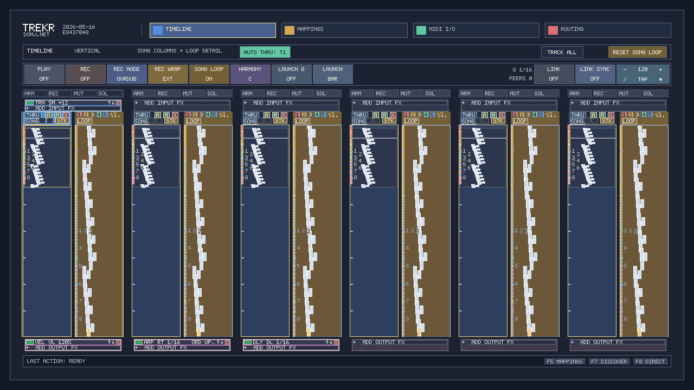
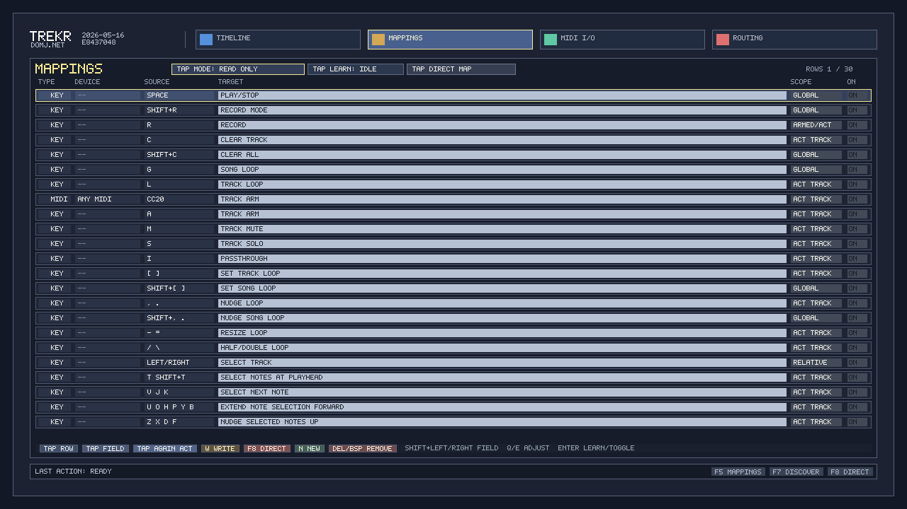
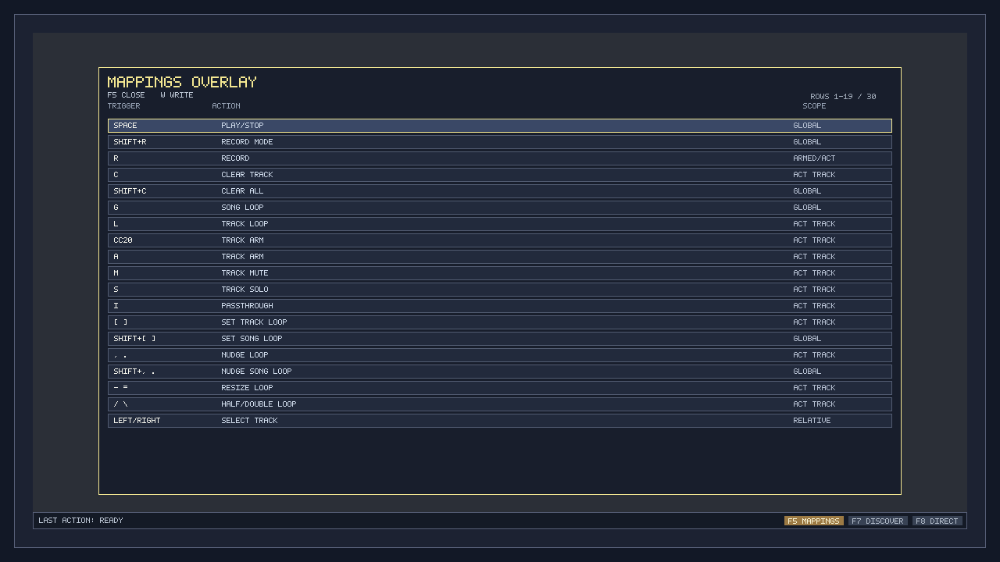
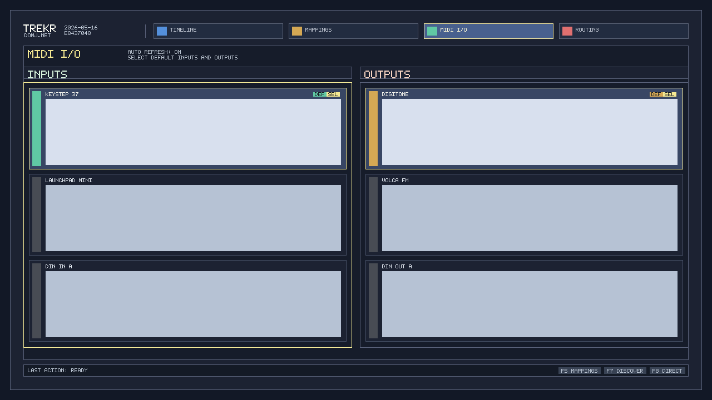
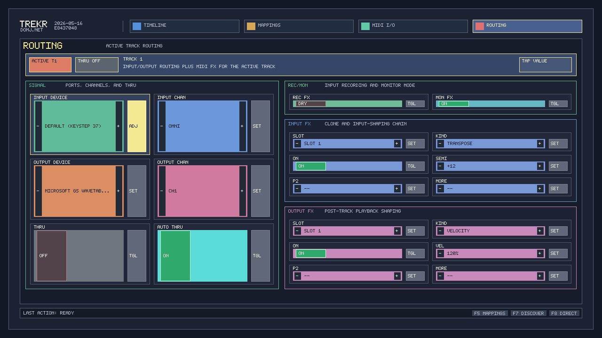

# trekr

Native MIDI-first tracker/player/looper for small PCs with a portable path to mobile-class targets.

## Screenshots

Latest renderer-owned captures from the demo state:

### Timeline



### Mappings



### Mappings Overlay



### MIDI I/O



### Routing



## Docs

- `docs/specs/product-spec.md`: product behavior, UX model, workflows, and MVP scope.
- `docs/specs/feature-spec-midi-arp.md`: focused arp behavior, parameters, and signal semantics.
- `docs/specs/feature-spec-stored-loops.md`: shipped stored-loop behavior and constraints.
- `docs/specs/feature-spec-stored-loops-future.md`: deferred stored-loop enhancements beyond V1.
- `docs/specs/feature-spec-midi-manipulation.md`: action-driven MIDI note selection and editing behavior.
- `docs/specs/ui-scaling-spec.md`: current implemented UI scaling behavior and constraints.
- `docs/specs/ui-density-presets-spec.md`: density preset behavior for default, compact, touch, and tiny layout modes.
- `docs/specs/feature-spec-clip-align.md`: proposed post-recording clip-to-loop alignment and tempo-fitting workflow.
- `docs/dev/architecture.md`: engine architecture, portability constraints, and stack options.
- `docs/planning/implementation-plan.md`: milestone order, module breakdown, and delivery sequence.
- `docs/planning/implementation-spec-clip-align.md`: implementation-focused plan for clip align state, actions, transform math, and tests.
- `docs/dev/current-mappings.md`: current keyboard bindings and prototype MIDI/OSC mapping overview.

## Current Direction

- Primary target: small-form-factor desktop systems.
- Secondary target: iOS/Android if the chosen stack supports it cleanly.
- V1 focus: MIDI sequencing, routing, passthrough, and loop-based recording.
- Audio follows MIDI-first V1 and should layer onto the same timeline and routing model later.
- Chosen implementation stack: Rust with a lightweight native rendering and I/O stack.
- SDL3 is built from source in the current scaffold so local builds do not depend on a preinstalled SDL runtime.

## Current Runnable Slice

`cargo run` opens a native SDL3 window with:

- fixed-fit per-track paired columns in the form `full | detail | full | detail`
- default vertical-time layout with time moving downward
- a page shell for `Timeline`, `Mappings`, `MIDI I/O`, and `Routing`
- real MIDI device enumeration via `midir`
- basic routed MIDI note playback on track output ports/channels
- per-track MIDI input/output FX slots with compact multi-parameter editing on the Routing page
- direct-editable per-track MIDI FX bands on the timeline, with input FX above the track pair and output FX below it
- live input monitoring can run dry or through input FX, and playback can run through output FX
- `Track Clone` mirrors the source track's pre-output MIDI signal, so source loop/clip playback can feed later destination input FX and `Post FX` recording
- clone-fed live signal now follows `Monitor Input FX` on the destination track, so cloned performance can be heard without enabling destination passthrough for direct matched input
- `Arp` now uses musical rate labels like `1/16`, supports timed playback/live held-note stepping, and can keep stepping held live notes even while transport is stopped
- `Duration` now uses absolute musical values (`Off`, `1/16`, `1/8`, `1/4`, ...) instead of percentage scaling, so the same fixed-length behavior can apply on playback and live input paths
- MIDI output runs on a dedicated worker thread so device stalls or hot-plug churn do not block the UI thread
- in-canvas bitmap text labels for pages, tracks, ports, mappings, and routing values
- active-track highlighting
- a moving playhead
- per-track loop preview
- per-track recording clip ownership with `Overlay` and `Stacked` timeline views
- per-recording clip selection, scroll, mute, and delete on the timeline
- selected recording clip align panel for clip-to-loop fitting and optional tempo matching
- focused-track timeline view for expanding the active track pair while keeping loop detail visible
- per-track MIDI note selection with focus/anchor highlighting in the timeline columns
- action-driven note stepping, span extend/contract, and pitch/time nudging on the active track
- a condensed single-row in-canvas transport strip on the timeline page, with taller touch-friendly buttons for transport/Link actions plus a composite tempo pad for `-`, `+`, half, double, and tap tempo
- a renderer-level footer/status bar that shows hover mapping summaries and falls back to the last performed action
- hover-driven mapping discoverability for timeline transport, track-state controls, and routing passthrough controls
- an inline mapping discoverability overlay with compact built-in vs user-defined badges
- a field-based mappings editor with MIDI learn for MIDI sources and inline target lookup for fast target selection
- a direct UI mapping mode for supported timeline and routing controls, driven from discoverability targets
- a cross-platform Ableton Link transport layer with runtime status in the transport strip
- direct mouse/touch control for tabs, transport controls, mappings, MIDI I/O selection, and routing fields
- optional thin-client session hosting over TCP, while retaining the normal in-process local app path
- an SDL thin client mode that mirrors the full app UI in a separate window and forwards keyboard/pointer input back to the host for host-authoritative action resolution

Launch state:

- `cargo run -- help` prints the CLI reference, option details, and suggested commands
- `cargo run -- commands` prints the recommended documented launch commands only
- `cargo run -- run` explicitly launches the interactive app
- default interactive run uses persisted state from `artifacts/state/last-run.json` when available and saves back on clean exit
- `cargo run -- --state-mode demo` forces the built-in demo state
- `cargo run -- --state-mode empty` forces an empty deterministic state
- `cargo run -- run --state-mode demo` is the subcommand form of the same demo launch
- `cargo run -- --state-file path\\to\\state.json` uses a specific persisted state path
- `cargo run -- --video-mode windowed` keeps the existing resizable desktop window behavior
- `cargo run -- --video-mode fullscreen` requests fullscreen rendering on the active SDL video backend
- `cargo run -- --video-mode kmsdrm-console` requests SDL's `kmsdrm` backend for direct fullscreen rendering from a Linux console session without X11/Wayland
- `cargo run -- run --listen 0.0.0.0:8788` keeps the normal SDL app local while also exposing it as a thin-client session host
- `cargo run -- capture-ui --state-mode demo --capture-dir artifacts/screenshots` renders deterministic screenshots without opening the interactive app
- `cargo run -- run --ui-density compact` launches the app with tighter shared layout metrics
- `cargo run -- run --ui-density touch` launches the app with larger touch-oriented spacing and targets
- `cargo run -- host-session --state-mode demo --listen 0.0.0.0:8788` runs a headless shared-session host for terminal or SDL thin clients
- `cargo run -- thin-client --connect 127.0.0.1:8788` connects a terminal thin client that mirrors shared transport/track state and can send context-free commands
- `cargo run -- thin-client-sdl --connect 127.0.0.1:8788` connects an SDL thin client window that mirrors the full current app UI and forwards keyboard/pointer input to the host
- crash diagnostics append to `artifacts/logs/trekr.log`, and panics capture a backtrace there in addition to stderr
- `cargo run -- run --theme high-contrast-dark` launches a darker high-contrast theme tuned for strong black-background separation
- `cargo run -- run --theme high-contrast-light` launches the light high-contrast theme
- `cargo run -- --ui-scale 2.0` forces a larger logical UI scale instead of using the OS-reported display scale
- `cargo run --bin trekr-tui` opens a terminal menu for selecting launch mode, state, video mode, scale, and capture path
- committed fixture state lives in `state-fixtures/ui-looped.json`

CLI notes:

- `run`, `capture-ui`, `host-session`, `thin-client`, `commands`, and `help` are the first-class app commands
- `thin-client-sdl` provides the SDL windowed thin-client variant alongside the terminal thin client, with parity-oriented remote rendering and input forwarding
- the older flag-only form is still supported for compatibility, so existing commands like `cargo run -- --state-mode demo` still work
- `capture-ui` accepts launch-state options plus `--capture-dir`; `--video-mode` remains interactive-only
- `--ui-density <default|compact|touch|tiny>` controls the shared spacing and hit-target preset independently from `--theme` and `--ui-scale`
- `TREKR_UI_DENSITY` provides the environment default when `--ui-density` is not passed
- `run` accepts `--listen` to expose the local SDL app as a shared session host without giving up the in-process path
- `host-session` accepts launch-state options plus a required `--listen`
- `thin-client` accepts `--connect` and optional `--name`

Pi console launch on-device:

```bash
./launch-rpi-zero-2w.sh
```

This wrapper starts `trekr` with `--video-mode kmsdrm-console` for a minimal Raspberry Pi console session.
It pins `SDL_VIDEODRIVER=kmsdrm`, `SDL_KMSDRM_REQUIRE_DRM_MASTER=1`, `SDL_KMSDRM_ATOMIC=0`, GLES loader hints, and `LD_LIBRARY_PATH` so the deployed binary uses the shipped SDL runtime and a Pi-oriented KMSDRM launch path.
It prefers `SDL_RENDER_DRIVER=opengles2` and you can override that to `software` only if the Pi image cannot initialize GLES.

Current working KMSDRM init path:

- build with the standard SDL path via `powershell -ExecutionPolicy Bypass -File .\scripts\build-rpi-zero-2w.ps1 -Release`
- deploy with `powershell -ExecutionPolicy Bypass -File .\scripts\deploy-rpi-zero-2w.ps1`
- launch from a Linux virtual console, not from X11 or Wayland, via `./launch-rpi-zero-2w.sh`
- let the launcher provide `SDL_VIDEODRIVER=kmsdrm`, `SDL_KMSDRM_REQUIRE_DRM_MASTER=1`, `SDL_KMSDRM_ATOMIC=0`, `SDL_RENDER_DRIVER=opengles2`, `SDL_EGL_LIBRARY=libEGL.so.1`, `SDL_OPENGL_LIBRARY=libGLESv2.so.2`, and `LD_LIBRARY_PATH`
- `trekr` then sets the SDL KMSDRM hints, creates a fullscreen borderless window, calls `window.sync()`, and uses the renderer-backed KMSDRM loop by default
- keep `TREKR_KMSDRM_PRESENT_MODE=surface` only as a diagnostic fallback when the renderer path is not usable on a given Pi image

Bootstrap and run:

- prefer `cargo xtask run` as the single setup-and-run command
- `cargo xtask setup` also initializes the `vendor/ableton-link` git submodule and its bundled `asio` dependency
- `cargo xtask run-demo` and `cargo xtask run-empty` do the same for the demo and empty launch modes
- `cargo xtask run -- --ui-scale 2.0` forwards extra app flags after `--`
- `cargo xtask check` initializes the submodule if needed, then runs `cargo check`
- the Cargo alias lives in `.cargo/config.toml`, so no extra task runner install is required

Current controls:

- `Tab` / `Shift+Tab`: next/previous page
- `F1` / `F2` / `F3` / `F4`: show timeline, mappings, MIDI I/O, or routing page
- `F5`: toggle the quick mappings overlay from any page
- `F7`: toggle the inline mapping discoverability overlay from any page
- `F8`: toggle direct UI mapping mode from any page
- `F6`: toggle Ableton Link participation
- `Shift+F6`: toggle Ableton Link start/stop sync participation
- `Up` / `Down`: select current page item
- `Shift+Left` / `Shift+Right` or `Shift+Up` / `Shift+Down`: select current editable field on the mappings page in write mode, or switch timeline control context on the timeline page
- `Q` / `E`: adjust current page item
- `Enter`: activate/toggle current page item, or advance the selected timeline FX edit field
- `Shift+Enter`: move backward through the selected timeline FX edit field
- `W`: toggle mappings page mode between read-only overview and write mode
- `N`: add a mapping row on the mappings page in write mode
- `Delete` / `Backspace`: remove the selected mapping row on the mappings page in write mode
- `Space`: play/stop
- `R`: start/stop recording on armed tracks, or the active track if none are armed
- `Shift+R`: cycle recording mode between `Overdub` and `Replace`
- `C`: clear current track notes/regions and cancel its pending take
- `Shift+C`: clear all track notes/regions and cancel pending takes
- `Home`: reset the global song loop to the full song range
- `[` / `]`: set current-track loop start/end at playhead
- `,` / `.`: nudge current-track loop backward/forward by one quantize step
- `-` / `=`: shorten/extend current-track loop by one quantize step
- `/` / `\`: half/double current-track loop length
- `Numpad1`..`Numpad8`: recall stored loop slots `1`..`8` on the active track
- `Alt+1`..`Alt+8`: laptop fallback for recalling stored loop slots `1`..`8` on the active track
- `Shift+Numpad1`..`Shift+Numpad8`: store the current active-track loop to stored loop slots `1`..`8`
- `Shift+Alt+1`..`Shift+Alt+8`: laptop fallback for storing the current active-track loop to slots `1`..`8`
- `Ctrl+Numpad1`..`Ctrl+Numpad8`: clear stored loop slots `1`..`8` on the active track
- `Ctrl+Alt+1`..`Ctrl+Alt+8`: laptop fallback for clearing stored loop slots `1`..`8`
- `Shift+L`: toggle global quantized stored-loop recall
- `Shift+Q`: cycle global stored-loop launch quantize (`Off`, `1/16`, `1/8`, `1/4`, `Bar`, `LoopEnd`)
- `Shift+[` / `Shift+]`: set global loop start/end at playhead
- `Shift+,` / `Shift+.`: nudge global loop backward/forward by one quantize step
- `Shift+-` / `Shift+=`: shorten/extend global loop by one quantize step
- `Shift+/` / `Shift+\`: half/double global loop length
- `G`: toggle global loop enable
- `Shift+G`: cycle the global harmony root (`C`..`B`)
- `L`: toggle current track loop enable
- `A`: arm current track
- `M`: mute current track
- `S`: solo current track
- `I`: toggle current track passthrough
- `T`: select notes intersecting the current track playhead
- `Shift+T`: additive select notes at the playhead without clearing the existing track note selection
- `V`: deselect notes on the active track
- `Shift+V`: toggle the active track between `Overlay` and `Stacked` recording views
- `J` / `K`: focus the previous/next note
- `Shift+J` / `Shift+K`: select the previous/next committed recording clip in stacked view
- `U` / `O`: focus the first/last selected note
- `H` / `P`: extend note selection backward/forward
- `Y`: extend note selection on both edges
- `B`: contract note selection from the focused edge
- `Z` / `X`: nudge selected notes earlier/later by the current quantize step, or `120` ticks when quantize is off
- `D` / `F`: nudge selected notes down/up by one semitone
- `Shift+M`: mute/unmute the selected committed recording clip in stacked view, or toggle the selected timeline FX on/off when an `Input FX` / `Output FX` context is active
- when `Input FX` or `Output FX` timeline context is selected:
  - `Up` / `Down`: select FX row
  - `Shift+Left` / `Shift+Right` or `Shift+Up` / `Shift+Down`: switch between `Input FX`, `Timeline`, and `Output FX`
  - `Enter` / `Shift+Enter`: cycle the active FX edit field forward/backward (`On`, `Kind`, `P1`, `P2`, `More`, `Move`)
  - `Q` / `E`: apply the selected FX field action (toggle, kind switch, primary/secondary parameter adjust, parameter-window scroll, reorder)
  - `Delete`: remove the selected timeline FX row
  - kind switching on an existing row cycles between effect kinds without removing the row; `None` is only reached through an empty `ADD ... FX` row
  - when a free slot exists, a single `Add Input FX` / `Add Output FX` row appears; selecting it and using `Q` / `E` on `Kind`, or clicking/tapping the row, inserts a new effect into the next empty slot
  - the former time-shift effect is now `Delay` (`DLY`) and uses musical values (`Off`, `1/16`, `1/8`, `1/4`, ...) instead of signed tick offsets; it only delays notes later, never earlier
  - `Duration` (`DUR`) now uses absolute musical values (`Off`, `1/16`, `1/8`, `1/4`, ...) rather than relative percentages; `Off` leaves the original note length unchanged
  - `Scale` and `Chord` quantizers expose `Root` plus `Tgt` (`Loc` / `Gbl`); `Gbl` follows the shared timeline `Harmony` transport chip
- `Shift+Enter`: open clip align for the selected committed recording clip

Stored loop slot indicators are shown subtly on the left side of each track loop header, expand to show as many slots as fit (focused view can show all `1`..`8`), and are clickable direct recall targets. Stored loops and the current track loop are also rendered in the track canvas as thin colored loop markers with start/end ticks and inline labels. When launch quantize is enabled, recalls queue per track and switch at the selected launch boundary (or immediately when launch quantize is `Off` / transport is stopped). `LoopEnd` uses each track's clip-cycle boundary (`transport_ticks % clip_loop_length`), so launch timing is independent from song-loop wrap. Recalling a stored loop also enables track loop on that track. Recalls are blocked on actively recording tracks.
- `Shift+Delete` / `Shift+Backspace`: delete the selected committed recording clip in stacked view
- `Shift+F8`: toggle focused-track timeline view for the active track
- `Left` / `Right`: select previous/next track directly
- `1`-`9`: select track by absolute index
- `Escape`: quit

The timeline page also exposes a clickable `Reset Song Loop` button that triggers the same action as `Home`.

Mapping discoverability notes:

- hovering supported action elements now uses the in-app footer as the primary mapping status surface
- the footer falls back to the last performed action when nothing discoverable is hovered
- `F7` enables a separate discoverability overlay with compact inline badges
- `F8` enters a direct mapping mode that highlights supported controls and captures the next MIDI note or CC for the selected target
- direct mapping now also accepts the next keyboard keypress, including `Ctrl`, `Alt`, and `Shift` modifier combinations
- discoverability badges use different colors for built-in keyboard bindings vs enabled user-defined mappings
- disabled mappings are hidden from the footer and discoverability overlay
- track-column discoverability is active-track scoped in V1, even when hovering non-active columns

Pointer/touch notes:

- tabs are clickable/tappable
- timeline transport controls use a single-row button bar with two-line labels and are clickable/tappable for play, record, record mode, loop-wrap clip extension (`Rec Wrap` + `Clamp` / `Ext`), song loop, global harmony root, Link, Link sync, launch quantize controls, and a composite tempo pad with `-`, `+`, `/`, `*`, and `Tap`
- each full track header exposes a clickable/tappable `THRU` button for passthrough
- each track header exposes a clickable/tappable recording-view toggle (`OVR` / `STK`)
- each timeline FX row now uses one compact single-line layout in all states; it favors shorter effect/parameter labels so parameter values stay visible, keeps `P2` before `More` when both are visible, and uses the `More` cell as a parameter-window position scroller
- each stacked track header exposes clickable/tappable `<` / `>` clip-scroll buttons that gray out when no more clips are available in that direction
- in stacked view, the active track shows a thin top scrollbar that reflects the visible clip window in both all-track and focused-track views
- in stacked view, recording lanes are clickable/tappable to select individual committed recording clips
- when a recording clip is selected, its header-level `ALIGN` / `MUT` / `DEL` controls are clickable/tappable
- the timeline header exposes a clickable/tappable focused-track toggle that collapses the timeline to the active track pair
- mappings rows and fields are clickable/tappable; in `Write` mode, tapping the selected field activates it
- the mappings page exposes a `Tap Direct Map` chip; when direct mapping is active, tapping a supported timeline or routing control selects or retargets the mapping target instead of triggering it
- MIDI I/O rows are clickable/tappable to select and set the default input/output
- MIDI I/O now auto-refreshes device availability while the app is running
- default input/output selections are preserved by device name and shown as offline when missing, instead of silently retargeting to another port
- track routing device selectors distinguish `None` (no route), `Default` (follow the current app default device), and explicit named ports
- routing and MIDI mapping device labels show an offline marker when their assigned port is currently unavailable, including `Default (offline)` when no current default resolves
- routing rows are clickable/tappable; tapping the value area adjusts the field and tapping passthrough toggles it
- the Routing page now groups `Signal`, `Input FX`, and `Output FX` into separate panes, with compact 2-column FX grids for per-slot `Slot`, `Kind`, `On`, and label-aware parameter cells that relabel to the current visible `P1` / `P2` parameters while `More` scrolls the parameter window
- the Timeline page shows per-track MIDI FX bands for input and output chains, with direct inline editing on the track
- timeline note and region editing is still not implemented for pointer/touch input

Recording flow notes:

- armed tracks are the first recording targets; if none are armed, recording uses the active track
- stopping playback while recording commits the active take instead of discarding it
- `RecWrap Extend` is the default and keeps a looped recording going past the loop boundary by rebasing the clip to loop start and extending its length instead of clamping the take at the loop end
- each committed record pass now becomes its own recording clip with stable ownership over its committed region and notes
- the timeline can show committed recording clips overlaid or stacked side by side per track while preserving record order
- stacked view keeps recording clips inside the track bounds with a per-track clip viewport and header scroll controls
- while recording in stacked view, the in-progress take appears immediately as a temporary last lane before commit
- selected recording clips can be muted, deleted, or aligned without clearing unrelated track content
- in stacked view, note-selection actions only operate on the currently selected recording clip
- the timeline shows committed regions behind notes and shows the in-progress take as a red preview region
- MIDI note content now comes from live input note-on/off events on each track's routed MIDI input, not a generated placeholder pattern

The `Mappings` page now supports two modes:

- `Read Only`: compact overview
- `Write`: field-based editing for source type, source device, source value, target, scope, and enabled state
- `Write` mode also supports adding/removing rows and cycling track-scoped mappings into concrete `Track 1`, `Track 2`, ... scopes
- selecting the `Target` field and pressing `Enter` opens inline lookup; type to filter targets, use `Up` / `Down` to choose, `Enter` to commit, and `Escape` to cancel
- mappings now also expose mappings-page editor/navigation actions as mapping targets, so row/field navigation and activation can be driven through the same canonical action model as the rest of the app
- `Cancel` is now also exposed as a mapping target so lookup/direct-mapping cancel can be triggered from non-keyboard inputs too
- direct UI mapping entry through `F8` or the `Tap Direct Map` chip, with target selection on supported timeline and routing controls

MIDI learn notes:

- in mappings `Write` mode, move to the `Source` field and press `Enter` to arm MIDI learn for the selected row
- the next incoming MIDI note or CC updates that mapping source and exits learn mode
- in direct mapping mode, select a supported control and the next incoming MIDI note or CC creates or replaces its mapping row
- after each direct mapping commit, the app stays in direct mapping mode so you can keep selecting controls and map a full surface quickly
- direct mapping entered from the mappings page returns to `Mappings` after commit; direct mapping entered in place keeps the current page so multiple controls can be mapped in sequence
- while direct mapping is awaiting input, selecting a different supported control retargets the pending mapping instead of requiring cancel first
- direct mapping also accepts keyboard capture for the selected control and stores normalized labels such as `Shift+R` or `Ctrl+Alt+M`
- `Escape` and `F8` stay reserved for cancel while direct mapping is armed
- learned MIDI mappings store the device name of the input that triggered learn
- live MIDI input now resolves against enabled mappings and can trigger app actions from either `Any MIDI` or a specific device
- `Shift+Left` / `Shift+Right` moves between editable mapping fields
- while target lookup is open, `Tab` is suppressed so lookup keeps focus until explicit commit/cancel
- while target lookup is open, canonical page actions now drive it too: next/previous item and adjust actions move the highlighted result through the full result set without wrapping, scrolling the visible list as needed, and activate commits it
- `Escape` now closes lookup via the canonical `Cancel` action, so cancel is action-tracked and remappable
- note-edit targets are available in the mappings page for playhead selection, span focus/resize, deselect, and pitch/time nudging
- recording-stack targets are available in the mappings page for recording view toggle, clip-step selection, selected clip mute, and selected clip delete

Ableton Link notes:

- Ableton Link now uses the official Ableton source from the `vendor/ableton-link` git submodule through a small native bridge, instead of the broken third-party Rust wrapper
- use `cargo xtask run` for first-run bootstrap, or `cargo xtask setup` explicitly, so the submodule and bundled `asio` dependency are initialized
- the transport strip shows Link enabled state, start/stop sync state, and peer count/status summary

The app also exposes a generic overlay layer with two independent modes:

- `F5`: quick mappings overlay
- `F7`: inline mapping discoverability overlay

Current planning note:

- the remaining MVP checklist now lives in `docs/planning/implementation-plan.md`
- Ableton Link is planned as a near-term sync milestone after the core MVP workflow is comfortable, and its architecture notes live in `docs/dev/architecture.md`

## Raspberry Pi Zero 2 W Cross-Build

The Raspberry Pi Zero 2 W is a Linux `aarch64` target, so the repo cross-build path is:

- target triple: `aarch64-unknown-linux-gnu`
- host flow: run the build inside WSL from Windows, rather than trying to drive a Linux linker from the Windows Rust toolchain

Repo entrypoint:

```powershell
powershell -ExecutionPolicy Bypass -File .\scripts\build-rpi-zero-2w.ps1 -Release
```

Pi console / KMSDRM entrypoint:

```powershell
powershell -ExecutionPolicy Bypass -File .\scripts\build-rpi-zero-2w.ps1 -Release -SdlUnixConsoleBuild
```

Recommended deployed Pi build:

```powershell
powershell -ExecutionPolicy Bypass -File .\scripts\build-rpi-zero-2w.ps1 -Release
```

SSH deployment entrypoint:

```powershell
powershell -ExecutionPolicy Bypass -File .\scripts\deploy-rpi-zero-2w.ps1
```

Pi runtime package setup:

```bash
sudo ./setup-rpi-zero-2w-runtime.sh
```

Expected artifact:

```text
target\aarch64-unknown-linux-gnu\release\trekr
```

WSL prerequisites:

- a working WSL distro with Rust installed inside that distro
- the Rust target installed inside WSL: `rustup target add aarch64-unknown-linux-gnu`
- Debian/Ubuntu package names for the Linux-side cross toolchain:
  - `gcc-aarch64-linux-gnu`
  - `g++-aarch64-linux-gnu`
  - `binutils-aarch64-linux-gnu`
  - `cmake`
  - `ninja-build`
  - `pkg-config`

Example setup inside WSL:

```bash
rustup target add aarch64-unknown-linux-gnu
sudo apt update
sudo apt install -y gcc-aarch64-linux-gnu g++-aarch64-linux-gnu binutils-aarch64-linux-gnu cmake ninja-build pkg-config
```

Notes:

- `scripts/build-rpi-zero-2w.ps1` fails fast if WSL is unavailable or the required Linux-side toolchain is missing.
- the normal deployed Pi path should use the standard SDL build. `-SdlUnixConsoleBuild` is retained as a diagnostic/experimental option, but it is not the recommended default for the fullscreen KMSDRM app path.
- Linux MIDI support goes through ALSA via `midir`, so if the final link step reports missing ALSA target libraries, install the matching ARM64 ALSA development package in the WSL distro/sysroot before retrying.
- Runtime on a minimal Pi console is opt-in: launch the binary with `--video-mode kmsdrm-console` to force SDL onto the `kmsdrm` backend. Desktop targets should stay on the default `windowed` mode.
- the deployed Pi launcher currently prefers `SDL_RENDER_DRIVER=opengles2` and sets `SDL_KMSDRM_ATOMIC=0`, which is the first compatibility path to try on Raspberry Pi when KMSDRM presents a black screen.
- `scripts/deploy-rpi-zero-2w.ps1` reads untracked local SSH settings from `scripts/rpi-deploy.local.psd1`. Start from the committed example file at `scripts/rpi-deploy.example.psd1`.
- the deploy flow copies `trekr`, `libSDL3.so.0`, and `launch-rpi-zero-2w.sh` into the remote app directory so the Pi does not need a system-installed SDL3 runtime.
- `scripts/setup-rpi-zero-2w-runtime.sh` installs the minimal Pi runtime packages needed for SDL KMSDRM, EGL/GLES loader discovery, and ALSA on a console-first image.
- `scripts/deploy-rpi-zero-2w.ps1 -InstallRuntimeDeps` can run that package setup remotely. If the local deploy config has no `Password`, the remote user needs passwordless `sudo`; otherwise the configured password is passed to `sudo -S`.
- Leaving `Password` blank in the deploy config uses normal OpenSSH key or agent auth through `ssh.exe` and `scp.exe`.
- Setting `Password` in the deploy config is supported only when `plink.exe` and `pscp.exe` are available on `PATH`.
- this path targets Pi Zero 2 W. The original Pi Zero / Zero W is a 32-bit ARMv6 device and needs a different target strategy.

## UI Review Loop

The repo includes a scripted screenshot-and-review loop for visual QA:

- `scripts/capture-ui-screens.ps1`: asks `trekr` itself to render `timeline`, `timeline-focused`, `mappings`, `midi-io`, and `routing` screenshots into `artifacts/screenshots`
  - capture explicitly uses `--state-mode demo` so screenshots stay deterministic instead of depending on the last persisted interactive state
  - capture also forces the demo MIDI device catalog so `MIDI I/O` does not depend on the local machine's live device list
- `scripts/review-ui-screens.ps1`: calls `codex exec` with those screenshots attached and writes findings to `artifacts/reviews/ui-findings.md`
- `scripts/run-ui-review.ps1`: runs both steps in sequence and archives the results under `artifacts/archive/<git-commit>/`

Tracked artifacts:

- `artifacts/screenshots/`: latest renderer-owned screenshots used by the README
- `artifacts/reviews/ui-findings.md`: latest compact screenshot review findings

Ignored artifacts:

- `artifacts/archive/`: commit-keyed review history
- `artifacts/state/`: last-run persisted state
- `docs/artifacts/` and `scripts/artifacts/`: stray/generated script-state directories

The capture path is renderer-owned rather than desktop-owned:

- screenshots are exported from the SDL drawing layer
- capture runs against an offscreen software surface, so other desktop apps do not leak into the images

Review process:

1. Run `powershell -ExecutionPolicy Bypass -File .\scripts\capture-ui-screens.ps1`
2. Check `artifacts/screenshots\manifest.json` for the exported page/image list
3. Run `powershell -ExecutionPolicy Bypass -File .\scripts\review-ui-screens.ps1`
4. Read `artifacts/reviews/ui-findings.md` for the latest Codex layout findings
5. Use `artifacts/archive/<git-commit>/screenshots` and `artifacts/archive/<git-commit>/reviews/ui-findings.md` for the commit-keyed snapshot

The review script passes the generated screenshots to `codex exec --image ...`, so the analysis step is based on the renderer-level captures rather than a live desktop screenshot.

Example:

```powershell
powershell -ExecutionPolicy Bypass -File .\scripts\run-ui-review.ps1
```

Fixture examples:

```powershell
cargo run -- --state-mode persisted --state-file state-fixtures/ui-looped.json
powershell -ExecutionPolicy Bypass -File .\scripts\run-ui-review.ps1 -StateMode persisted -StateFile state-fixtures/ui-looped.json
```

### Pixel-exact screenshot regression

For default-density parity work, use the renderer-owned screenshots as an exact regression gate instead of a visual approximation.

Requirements for deterministic captures:

- use `--state-mode demo`
- capture both baseline and candidate on the same machine/toolchain
- blank the build branding vars before each build so the Git SHA/date do not render:
  - `TREKR_BUILD_HASH`
  - `TREKR_BUILD_DATE`

Example workflow against `origin/main`:

```powershell
$env:TREKR_BUILD_HASH=''
$env:TREKR_BUILD_DATE=''
git worktree add ..\trekr-main origin/main
powershell -ExecutionPolicy Bypass -File .\scripts\capture-ui-screens.ps1 -StateMode demo -OutputDir artifacts\archive\candidate
powershell -ExecutionPolicy Bypass -File ..\trekr-main\scripts\capture-ui-screens.ps1 -StateMode demo -OutputDir artifacts\archive\baseline-main
powershell -ExecutionPolicy Bypass -File .\scripts\compare-ui-screens.ps1 -BaselineDir artifacts\archive\baseline-main -CandidateDir artifacts\archive\candidate -DiffOutputDir artifacts\archive\pixel-diff
git worktree remove ..\trekr-main
```

`scripts/compare-ui-screens.ps1` fails on any nonzero pixel difference and can emit per-page red/black diff images when `-DiffOutputDir` is provided.

## Pi Camera Debug Review

The repo also includes a separate physical-camera debug path for reviewing the deployed Pi's actual screen output from the development machine.

This flow is intended for a local capture device such as `Cam Link 4K` connected to the development machine, pointed at the Pi display. It does not run on the Pi itself.

Committed files:

- `scripts/capture-pi-output-camera.ps1`: captures one frame from a local DirectShow camera device into `artifacts/camera-debug`
- `scripts/capture-pi-output-camera-clip.ps1`: records a short local HDMI capture clip into `artifacts/camera-debug`
- `scripts/analyze-pi-output-camera-clip.ps1`: downsamples a captured clip and writes brightness/frame-diff metrics into `artifacts/camera-debug/clip-analysis`
- `scripts/review-pi-output-camera.ps1`: sends the captured image to `codex exec` for a compact diagnostic review
- `scripts/run-pi-output-camera-review.ps1`: runs capture and review together and archives the result under `artifacts/archive/<git-commit>/camera-debug`
- `scripts/pi-camera-debug.example.psd1`: example local camera config

Local setup:

- copy `scripts/pi-camera-debug.example.psd1` to `scripts/pi-camera-debug.local.psd1` if you want to override the default local capture device or format
- the local config is ignored by git
- the current default device name is `usb video`
- set `VideoCodec` for devices that expose compressed capture modes such as `mjpeg`; otherwise use `PixelFormat`
- if DirectShow is flaky with the friendly device name during active capture, set `DeviceInput` to the camera's alternative PnP selector from `-ListDevices`

Useful commands:

```powershell
powershell -ExecutionPolicy Bypass -File .\scripts\capture-pi-output-camera.ps1 -ListDevices
powershell -ExecutionPolicy Bypass -File .\scripts\capture-pi-output-camera.ps1 -ListOptions
powershell -ExecutionPolicy Bypass -File .\scripts\capture-pi-output-camera.ps1
powershell -ExecutionPolicy Bypass -File .\scripts\capture-pi-output-camera-clip.ps1 -DurationSeconds 10
powershell -ExecutionPolicy Bypass -File .\scripts\analyze-pi-output-camera-clip.ps1
powershell -ExecutionPolicy Bypass -File .\scripts\review-pi-output-camera.ps1
powershell -ExecutionPolicy Bypass -File .\scripts\run-pi-output-camera-review.ps1
```

Notes:

- this flow uses local `ffmpeg` DirectShow capture, not renderer-owned screenshots
- by default it also records a small remote Pi status snapshot into `artifacts/camera-debug/pi-status.txt` using `scripts/rpi-deploy.local.psd1` if that config exists
- if `ffmpeg` reports `Could not run graph`, the capture device is usually already in use by another app such as OBS

